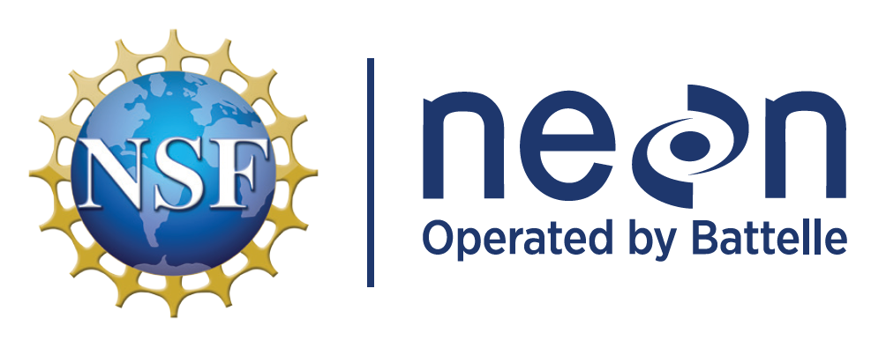

Working with data from the US National Ecological Observatory Network
================

<!-- README.md is generated from README.Rmd. Please edit that file -->
<!-- ****** Description ****** -->

This repository contains the code that will be used for the 2023 GLEON
virtual meeting
(<https://gleon.org/meetings/GLEON2023Virtual/Program_Overview>) and
2022 GLEON all hands meeting workshop: Working with data from the US
National Ecological Observatory Network
(<https://gleon.org/meetings/gleon22/Workshops>).

<!-- ****** Organizers ****** -->

Organized by Kevin Rose (Rensselaer Polytechnic Institute) and led by
Kaelin Cawley, Bobby Hensley, and Stephanie Parker (all from NEON).

<!-- ****** Prep ****** -->

## Preparation for the workshop

1.  Optional, but very helpful! Create an API token using the
    instructions in the following tutorial, which shouldn’t take more
    than 10 minutes
    (<https://www.neonscience.org/resources/learning-hub/tutorials/neon-api-tokens-tutorial>)
2.  Ensure that you have a recent R version installed on your computer.
    (Tutorial leaders will have version \>= 4.2.0)
3.  The tutorial leaders will use RStudio, which is also recommended,
    but optional.
4.  Install required packages: `neonUtilities`, `tidyverse`, `ecocomDP`,
    `vegan`, `ggplot2`, and `lubridate.`. You can run the following to
    install all the packages:
    install.packages(c(‘neonUtilities’,‘tidyverse’,‘ecocomDP’,‘vegan’,‘ggplot2’,‘lubridate’))

<!-- ****** Agenda ****** -->

## Agenda for the Feb 2023 virtual workshop

1.  2 recorded introductory videos for the NEON Observatory and data
    portal
2.  A recorded 4-part aquatic instrument system coding tutorial
3.  A recorded 3-part aquatic macroinvertebrate diversity coding
    tutorial
4.  There will be a live Q&A session Tuesday February 14th at 13:00 UTC

<!-- ****** Agenda ****** -->

## Agenda for the Oct 2022 in-person workshop

1.  20 minute introduction to the NEON Observatory and data portal
2.  70 minute live coding tutorial in R using lake chemical and physical
    data (NEON-AIS-data-GLEON2022.Rmd script in this repo)
3.  30 minute break
4.  60 minute live coding tutorial in R using lake biological data
    (<https://www.neonscience.org/resources/learning-hub/tutorials/neon-biodiversity-ecocomdp-cyverse>)

<!-- ****** Intro Links ****** -->

## Introduction Links

Getting started with NEON data:
<https://www.neonscience.org/resources/getting-started-neon-data-resources>

Contact us form: <https://www.neonscience.org/about/contact-us>

Teaching Modules:
<https://www.neonscience.org/resources/learning-hub/teaching-modules>
  QUBES modules:
<https://qubeshub.org/community/groups/neon/educational_resources>
  EDDIE modules :
<https://serc.carleton.edu/eddie/macrosystems/index.html>

Spatial data and maps: <https://neon.maps.arcgis.com/home/index.html>

<!-- Como Creek NEON (COMO) site page: https://www.neonscience.org/field-sites/como    -->
<!-- Note: Just substitute the 4-letter site code at the end of the url to see any other site page. -->

NEON data portal: <https://data.neonscience.org/>

NEONScience GitHub repo: <https://github.com/NEONScience>  
GLEON-NEON 2022 Workshop GitHub repo:
<https://github.com/NEONScience/WORKSHOP-GLEON-NEON-2022>

<!-- ****** Usage ****** -->

## Usage

This repository is designed to be used with NEON data as part of a
virtual tutorial taking place February 2023
(<https://gleon.org/meetings/GLEON2023Virtual/Program_Overview>) or live
tutorial taking place October 30th, 2022
(<https://gleon.org/meetings/gleon22/Program_Overview>).

<!-- ****** Acknowledgements ****** -->

## Credits & Acknowledgements

<!-- HTML tags to produce image, resize, add hyperlink. -->
<!-- ONLY WORKS WITH HTML or GITHUB documents -->

<!-- Acknowledgements text -->

The National Ecological Observatory Network is a project solely funded
by the National Science Foundation and managed under cooperative
agreement by Battelle. Any opinions, findings, and conclusions or
recommendations expressed in this material are those of the author(s)
and do not necessarily reflect the views of the National Science
Foundation.

<!-- ****** License ****** -->

## License

CC0 1.0 Universal

<!-- ****** Disclaimer ****** -->

## Disclaimer

*Information and documents contained within this page are available
as-is. Codes or documents, or their use, may not be supported or
maintained under any program or service and may not be compatible with
data currently available from the NEON Data Portal.*
